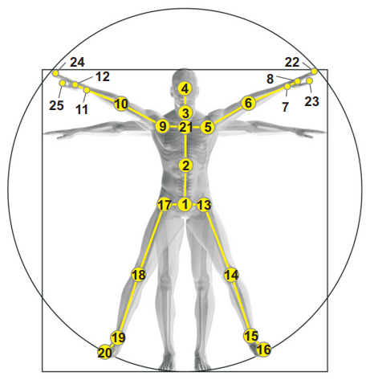
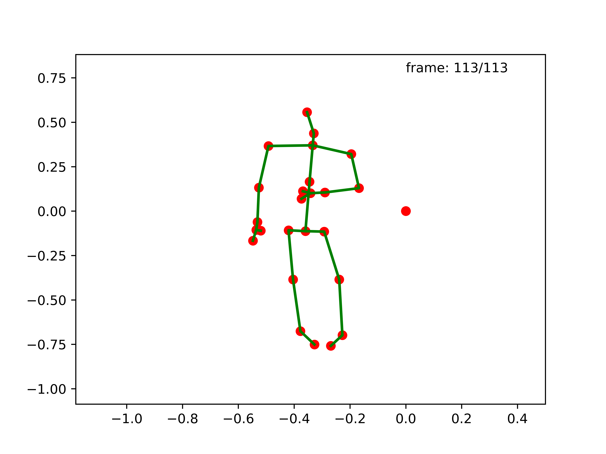
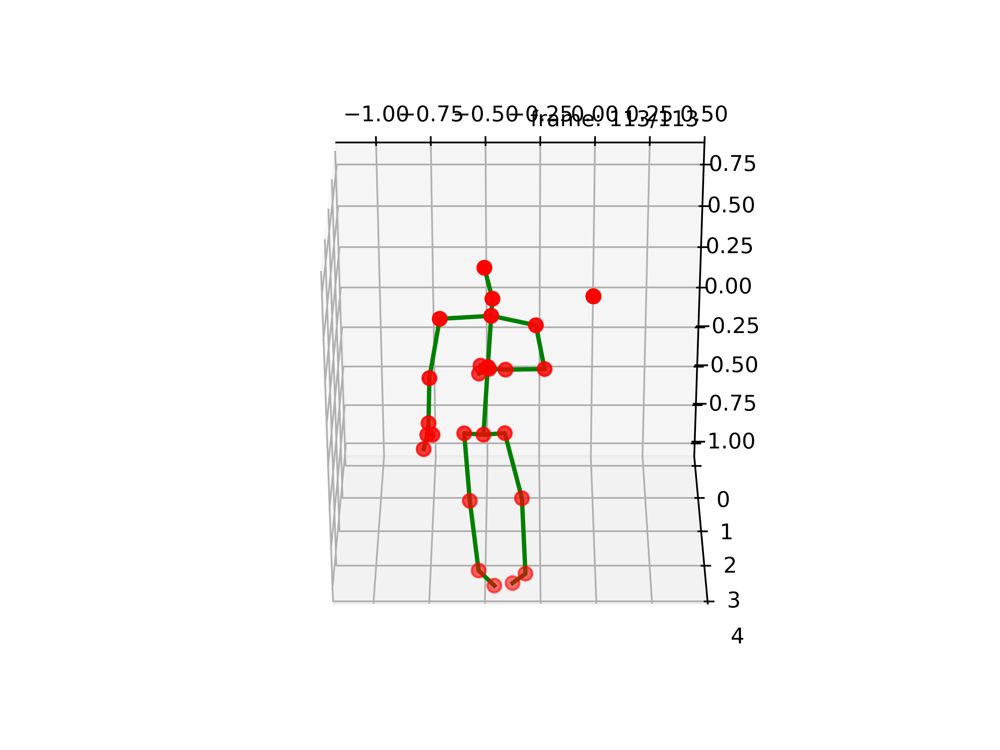

# README


## 环境

`Ubuntu 22.04.4 LTS`

`RTX 4090D(24GB) `

`Cuda 12.4`

`Python 3.12.9`

`PyTorch 2.6.0`

Python依赖：`requirements.txt`


## 项目结构

```
./config/ # 配置文件
|-- nturgbd-cross-subject		# 将数据（NTU RGB+D 60）按 受试者 划分训练集和测试集，测试模型对未见过的人的泛化能力
|   `-- default.yaml
|-- nturgbd-cross-view			# 将数据（NTU RGB+D 60）按 视角 划分训练集和测试集，测试模型对不同拍摄角度的适应性。
|   `-- default.yaml
|-- nturgbd120-cross-set		# 将数据（NTU RGB+D 120）按 受试者 划分训练集和测试集，测试模型对未见过的人的泛化能力
|   `-- default.yaml 
|-- nturgbd120-cross-subject	# 将数据（NTU RGB+D 120）按 视角 划分训练集和测试集，测试模型对不同拍摄角度的适应性。
|   `-- default.yaml
|-- ucla						# 可将数据（NW-UCLA）按 骨架/动作/骨架+动作 划分
	   `-- default.yaml
```

```
./data/
|-- NW-UCLA 						# 存储NW-UCLA数据集的相关文件
|   |-- all_sqe						# NW-UCLA 解压到此处
|   `-- val_label.pkl				# 存储验证集的标签（动作类别和对应的样本ID）
|-- ntu 							# 处理NTU RGB+D 60数据集的预处理脚本和统计文件。
|       `-- ......
|-- ntu120 							# 处理NTU RGB+D 120数据集的预处理脚本和统计文件。
|   |-- NTU120_CSub.npz				# 预处理后的数据文件，按受试者划分
|   |-- NTU120_CSet.npz				# 预处理后的数据文件，按视角划分
|   |-- denoised_data				# 去噪过程的中间文件和日志
|   |   `-- ......
|   |-- get_raw_denoised_data.py	# 去噪
|   |-- get_raw_skes_data.py		# 提取骨架
|   |-- raw_data					# 日志信息等
|   |   `-- ......
|   |-- seq_transformation.py		# 生成模型输入
|   `-- statistics					# 标签信息等
|       `-- ......
`-- nturgbd_raw
    |-- nturgb+d_skeletons		# NTU RGB+D 60 解压到此处
    `-- nturgb+d_skeletons120	# NTU RGB+D 120 解压到此处
```

```
./feeders/			# 从预处理后的数据集中读取数据并为模型提供输入
|-- bone_pairs.py	# 定义骨架的骨骼对（关节连接）
|-- feeder_ntu.py	# NTU数据集的数据加载器
|-- feeder_ucla.py	# ucla数据集的数据加载器
`-- tools.py		# 数据处理的辅助工具
```

```
./graph/			# 定义骨架关节之间的连接关系（邻接矩阵），为图卷积操作提供基础
|-- ntu_rgb_d.py	# NTU RGB+D数据集的图结构
|-- tools.py		# 图处理辅助工具
`-- ucla.py			# ucla数据集的图结构
```

```
./model/			# 存储模型定义的目录
|-- baseline.py		# 实现基本的时空图卷积网络
`-- ......
```

```
./torchlight/		# 定义PyTorch一些工具
	`-- ......
```

```
./work_dir/			# 记录训练信息，权重文件
	`-- ......
```


## 数据集

| **属性**          | **NTU RGB+D 60**                                             | **NTU RGB+D 120**                                            | **NW-UCLA**                                                |
| ----------------- | ------------------------------------------------------------ | ------------------------------------------------------------ | ---------------------------------------------------------- |
| **发布年份**      | 2016                                                         | 2019                                                         | 2014                                                       |
| **动作类别数**    | 60                                                           | 120                                                          | 10                                                         |
| **样本数**        | 56,880                                                       | 114,480                                                      | ≈1,494                                                     |
| **受试者数**      | 40                                                           | 106                                                          | 10                                                         |
| **关节数**        | 25                                                           | 25                                                           | 20                                                         |
| **数据维度**      | 3D (x, y, z)                                                 | 3D (x, y, z)                                                 | 3D (x, y, z)                                               |
| **采集设备**      | Microsoft Kinect v2                                          | Microsoft Kinect v2                                          | Microsoft Kinect v1                                        |
| **帧率**          | 30 FPS                                                       | 30 FPS                                                       | 30 FPS                                                     |
| **视角数**        | 3 (不同摄像头角度)                                           | 3 (不同摄像头角度)                                           | 3 (不同摄像头角度)                                         |
| **数据类型**      | RGB视频、深度图、3D骨架、红外视频                            | RGB视频、深度图、3D骨架、红外视频                            | RGB视频、深度图、3D骨架                                    |
| **评估协议**      | 跨主体 (Cross-Subject) <br> 跨视角 (Cross-View)              | 跨主体 (Cross-Subject) <br> 跨设置 (Cross-Setup)             | 跨视角 (Cross-View)                                        |
| **训练/测试划分** | 跨主体: 40,320 / 16,560 <br> 跨视角: 37,920 / 18,960         | 跨主体: 63,026 / 51,454 <br> 跨设置: 57,307 / 57,173         | 跨视角: 1st+2nd视角 / 3rd视角 (≈1,000 / ≈494)              |
| **文件格式**      | .npz (预处理骨架数据)                                        | .npz (预处理骨架数据)                                        | .mat 或 .skeleton (预处理骨架数据)                         |
| **主要挑战**      | 多视角、双人交互、动作相似性                                 | 更多动作类别、采集设置变化                                   | 数据量少、视角变化                                         |
| **典型应用**      | 动作识别、人机交互                                           | 动作识别、行为分析                                           | 动作识别、跨视角泛化                                       |
| **下载链接**      | https://drive.google.com/file/d/1CUZnBtYwifVXS21yVg62T-vrPVayso5H/view | https://drive.google.com/file/d/1tEbuaEqMxAV7dNc4fqu1O4M7mC6CJ50w/view | https://www.dropbox.com/s/10pcm4pksjy6mkq/all_sqe.zip?dl=0 |


**NTU RGB+D **

Shahroudy A, Liu J, Ng T T, et al. Ntu rgb+ d: A large scale dataset for 3d human activity analysis[C]//Proceedings of the IEEE conference on computer vision and pattern recognition. 2016: 1010-1019.



S018C001P008R001A066.skeleton

```
114
1
72057594037932493 0 1 1 1 1 0 -0.03059456 0.1197834 2
25
-0.3772397 -0.1324144 3.533824 217.2835 222.2075 863.2433 606.4524 -0.1524733 0.04301447 0.9815636 -0.1069321 2
-0.3616867 0.1596663 3.4669 218.1704 191.642 866.3636 518.2155 -0.159685 0.0437994 0.9804162 -0.106613 2
-0.3465753 0.4474662 3.386939 218.8557 160.0887 869.0795 427.2568 -0.1667326 0.05204619 0.9739474 -0.14463 2
-0.3802827 0.5805618 3.350174 214.7112 144.9301 857.5105 383.6505 0 0 0 0 2
-0.5164834 0.3486652 3.463456 201.6906 171.5976 819.082 460.3431 0.1716727 0.7593219 -0.6266006 -0.03647156 2
-0.5415716 0.1134874 3.531058 200.1673 196.7227 814.0917 532.7734 0.08497439 0.8135057 -0.1214269 -0.5623552 2
-0.5352477 -0.1224186 3.515426 200.5771 221.2511 815.1454 603.5446 -0.03237363 0.6833526 -0.01498218 0.7292166 2
-0.5282679 -0.1654682 3.523757 201.4333 225.6964 817.5482 616.3749 0.005877789 0.672842 0.1231915 0.7294333 2
-0.1996725 0.3289829 3.349979 234.5358 172.5573 914.3873 463.2503 -0.0508953 0.766526 0.5980077 -0.2285483 2
-0.1603336 0.08766363 3.392898 239.0706 199.0489 927.0391 539.7371 0.05525654 0.9355068 0.1043654 0.3329889 2
-0.1825746 -0.1241112 3.383913 236.6192 221.9069 919.8144 605.7437 -0.04676649 0.8270376 -0.03146193 -0.5593137 2
-0.2004368 -0.1820445 3.390207 234.7251 228.1343 914.2639 623.7093 -0.04216268 0.8093776 -0.1515659 -0.5658252 2
-0.4431217 -0.1284472 3.522024 210.2903 221.8462 843.1172 605.3485 -0.01954505 -0.6716346 0.7274632 -0.1390049 2
-0.4079847 -0.375588 3.631152 215.1959 246.38 856.6641 676.1499 -0.1718402 -0.5607536 0.1299896 0.7994554 2
-0.3764531 -0.6755122 3.758112 219.6061 274.4258 868.7675 756.8848 0.1966712 0.8515647 -0.05493376 -0.4828459 2
-0.3297989 -0.75229 3.719262 223.8088 282.7195 881.0126 780.7419 0 0 0 0 2
-0.3044002 -0.1332553 3.476962 224.3211 222.5157 883.8247 607.4021 -0.1783849 0.6524034 0.6809033 -0.280926 2
-0.2267192 -0.4161285 3.576762 233.1429 251.0871 908.6839 689.8925 0.06369826 0.8076186 0.1987105 0.5515515 2
-0.2293349 -0.6968759 3.711679 233.6902 277.3456 909.5563 765.4188 0.1771718 0.7660317 0.1340287 0.6031931 2
-0.2606179 -0.7578467 3.598554 229.7705 285.7802 898.6921 789.5856 0 0 0 0 2
-0.3505513 0.376195 3.409312 218.69 168.0826 868.3954 450.2759 -0.1671625 0.04651478 0.9770688 -0.1234087 2
-0.5276843 -0.2241332 3.535636 201.6712 231.7195 818.1486 633.7469 0 0 0 0 2
-0.4902444 -0.1555478 3.499075 205.0392 224.7751 828.0601 613.7516 0 0 0 0 2
-0.2213281 -0.2486807 3.381557 232.4032 235.3996 907.5479 644.6573 0 0 0 0 2
-0.2261355 -0.1695059 3.364616 231.7657 226.9219 905.8452 620.1848 0 0 0 0 2
```

第1行：帧数，表示该skeleton文件共有114帧；

第2行：body数，表示该视频帧中出现了一个body；

第3行：共有10个数字，依次表示：'bodyID',  'clipedEdges',  'handLeftConfidence',  'handLeftState',  'handRightConfidence',  'handRightState',  'isResticted',  'leanX',  'leanY', 'trackingState'；

第4行：关节数，数字25表示共有25个关节；

第5-29行：25个关节的数据，共有12个数字，依次表示：'x',  'y',  'z',  'depthX',  'depthY',  'colorX',  'colorY',  'orientationW',  'orientationX',  'orientationY',  'orientationZ',  'trackingState'；

之后便是第2帧的数据，遵循上述规则。


数据集可视化

```
python test/showSkeleton.py
```




## 数据处理

```
 cd ./data/ntu120
 # 提取骨架
 python get_raw_skes_data.py
 # 去噪
 python get_raw_denoised_data.py
 # 生成模型输入
 python seq_transformation.py
```


## 训练

```
nohup python main.py --config config/nturgbd120-cross-subject/actgcn_1.yaml > /dev/null 2>&1 &
```


## 相关工作

基于图的动作识别方法近年来在骨骼数据上取得了显著进展。GCN通过建模关节之间的空间和时间关系，能够有效捕捉动作的结构化特征。以下是相关模型的概述：

- **baseline.py**：一个标准GCN模型，使用固定邻接矩阵，缺乏自适应性和注意力机制，适合基础任务但对复杂动作适应性有限。
- **2s-AGCN**：提出自适应图学习，通过可训练参数调整邻接矩阵，并引入空间、时间和通道注意力机制，显著提升了模型对关键特征的聚焦能力，特别是在动态动作数据上表现优异。
- **CTR-GCN**：引入通道-时间关系图卷积（CTRGC），通过数据依赖的方式动态学习图结构，并结合多尺度时间卷积，捕捉短时和长时依赖，适用于时间复杂性较高的任务。

**ACT-GCN模型整合了CTR-GCN的动态图学习和2s-AGCN的注意力机制，旨在结合两者优势，克服单一模型的局限性。**

## 方法

ACT-GCN的架构包括以下主要组件：

- **数据归一化层**：对输入骨骼数据进行批归一化，确保数据分布一致。
- **TCN_GCN单元**：由一系列单元组成，每个单元包括：
  - **图卷积单元（new_unit_gcn）**：使用CTRGC进行动态图学习，允许模型根据输入数据调整图结构；随后应用注意力机制，包括空间注意力（聚焦关键关节）、时间注意力（聚焦重要时间帧）和通道注意力（增强特征通道），以提升模型对关键信息的聚焦能力。
  - **多尺度时间卷积单元（MultiScale_TemporalConv）**：通过不同扩张率（dilations=[1,2]）的分支捕捉短时和长时依赖，包括最大池化分支和1x1卷积分支，输出通过拼接后与残差连接相加。
- **残差连接和ReLU激活**：在每个单元后应用ReLU激活，并通过残差连接缓解深层网络的梯度消失问题，确保训练稳定性。
- **全连接层**：将最终特征映射到60个类别（NTU RGB+D 120的默认设置），用于分类。

模型设计中，图卷积单元的注意力机制通过1D卷积和线性层实现，具体包括空间注意力（conv_sa）、时间注意力（conv_ta）和通道注意力（fc1c、fc2c）。多尺度时间卷积通过扩张卷积和池化分支，捕捉不同时间尺度的动作特征，增强模型的鲁棒性。